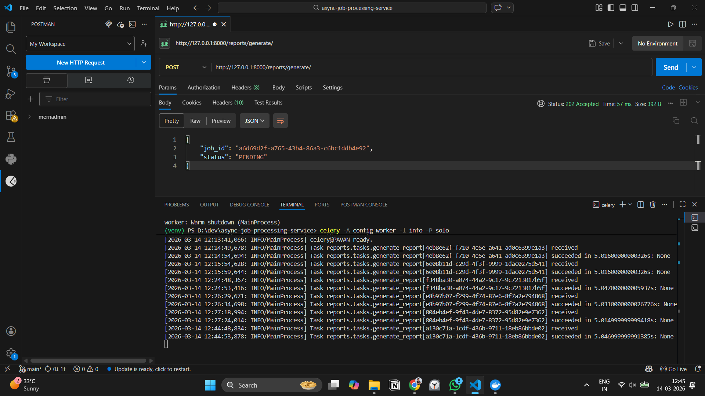
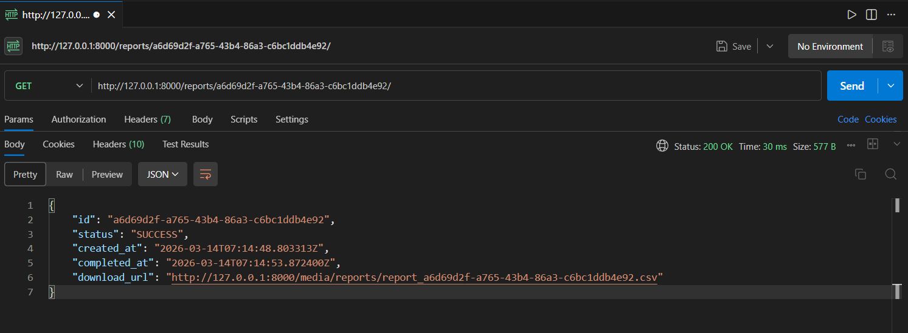

# Async Report Processing Service

A backend service that generates reports asynchronously using background workers.
This project demonstrates how long-running tasks can be processed outside the HTTP request cycle using a distributed task queue.

## Tech Stack
* Django
* Django REST Framework
* Celery
* Redis
* SQLite

## Problem
Generating large reports inside an HTTP request can block the server and lead to slow API responses or timeouts.
This service solves the problem by processing report generation tasks in the background.

## Architecture
Client
│
POST /reports/generate
│
Django REST API
│
sqlite3 (stores job metadata)
│
Redis (message broker)
│
Celery Worker
│
CSV Report Generated
│
Download URL Returned

## API Endpoints
### Generate Report

POST /reports/generate

Response

{
"job_id": "uuid",
"status": "PENDING"
}

### Check Report Status

GET /reports/{job_id}

Response

{
"id": "uuid",
"status": "SUCCESS",
"download_url": "http://localhost:8000/media/reports/report_uuid.csv"
}

## Job Lifecycle

PENDING → PROCESSING → SUCCESS / FAILED

## Running the Project

### 1 Install dependencies
pip install -r requirements.txt
### 2 Run Redis
docker run -p 6379:6379 redis
### 3 Run Django
python manage.py runserver
### 4 Start Celery worker
celery -A config worker -l info -P solo

## Example Flow

1. Client requests a report

POST /reports/generate

2. API creates a job and pushes it to Redis queue

3. Celery worker processes the job asynchronously

4. CSV report is generated and stored

5. Client retrieves the download URL

GET /reports/{job_id}

## Demo

## Key Backend Concepts Demonstrated

* Asynchronous task processing
* Message queues
* Background workers
* Job lifecycle management
* API polling pattern
